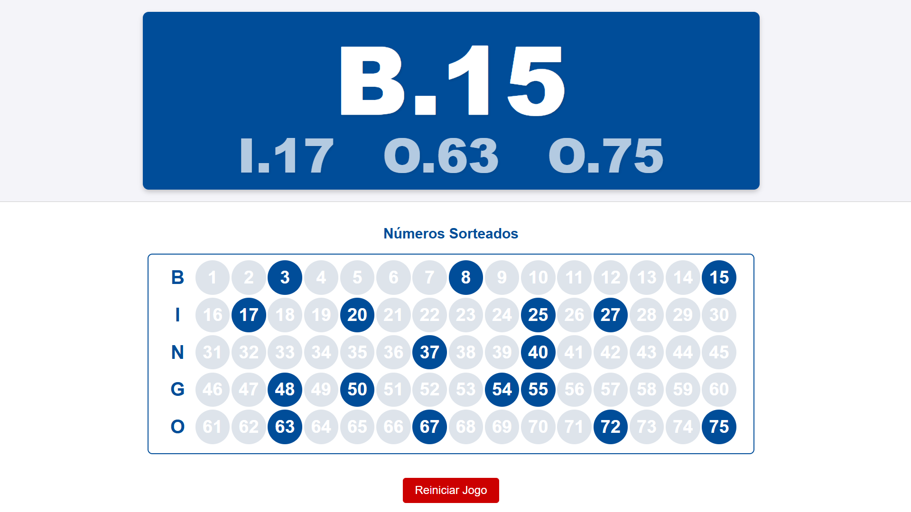

# Projetos Html #
Quando me surge uma ideia e a implementação parece ser tão simples que pode ser feita em Html no mesmo dia. Então surge um projeto.
Não é um requisito, mas cada html é totalmente funcional localmente e offline.

## Bingo ##
Imagine que você vai organizar um bingo. O quão incrível seria exibir todos os resultados em um telão? Eis que tenho uma solução.
Abra o arquivo bingo.html no seu navegador e com [F11] deixe em tela cheia.

