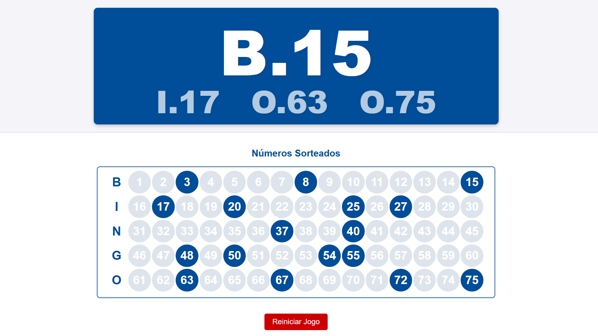
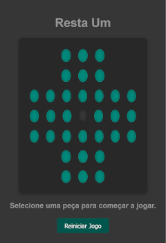
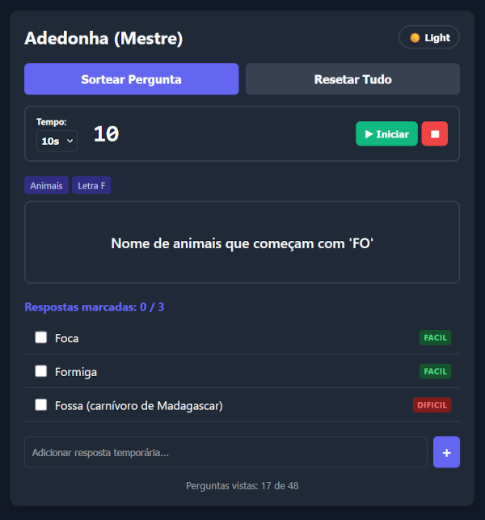

# Projetos Rápidos #
Quando surge aquela ideia cuja implementação parece tão simples que dá para fazer em HTML no mesmo dia, é aí que nasce um projeto!
Não é um requisito, mas garanto: cada projeto é totalmente funcional localmente e offline.

## Bingo - [bingo.html](https://diogorbg.github.io/Projetos-Html/bingo/bingo.html)
Imagine que você vai organizar um bingo. Que tal exibir os resultados em um telão de forma incrível? Eu tenho a solução!
Basta abrir o bingo.html no seu navegador e usar [F11] para colocar em tela cheia.\

## Resta Um - [restaUm.html](https://diogorbg.github.io/Projetos-Html/restaUm/restaUm.html)
Bateu uma saudade de jogar Resta Um! As regras são simples: você deve "comer" as peças — como no jogo de Damas, mas apenas na vertical e horizontal — até sobrar uma. Deve haver milhões de aplicativos por aí, mas eu garanto que este não tem propagandas nem microtransações!\

## Adedonha (Mestre) - [adedonha.html](https://diogorbg.github.io/Projetos-Html/adedonha/adedonha.html)
Esta é a ficha oficial do apresentador para uma dinâmica estilo Adedonha em ritmo acelerado! Organize os participantes em uma fila e sorteie o desafio da rodada. Um de cada vez, os jogadores devem dar uma resposta válida antes que o cronômetro zere. Conforme as palavras fáceis se esgotam, a pressão aumenta! Quem acertar, volta para o fim da fila; quem errar ou repetir o que já foi dito, está fora. A pergunta não para até restar apenas um sobrevivente. Você está no controle do tempo e das respostas!\

