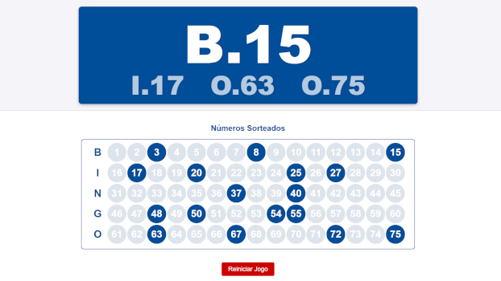

# Projetos Rápidos #
Quando surge aquela ideia cuja implementação parece tão simples que dá para fazer em HTML no mesmo dia, é aí que nasce um projeto!
Não é um requisito, mas garanto: cada projeto é totalmente funcional localmente e offline.

## Bingo - [bingo.html](https://diogorbg.github.io/Projetos-Html/bingo/bingo.html)
Imagine que você vai organizar um bingo. Que tal exibir os resultados em um telão de forma incrível? Eu tenho a solução!
Basta abrir o bingo.html no seu navegador e usar [F11] para colocar em tela cheia.

## Resta Um - [restaUm.html](https://diogorbg.github.io/Projetos-Html/restaUm/restaUm.html)
Bateu uma saudade de jogar Resta Um! As regras são simples: você deve "comer" as peças — como no jogo de Damas, mas apenas na vertical e horizontal — até sobrar uma. Deve haver milhões de aplicativos por aí, mas eu garanto que este não tem propagandas nem microtransações!

